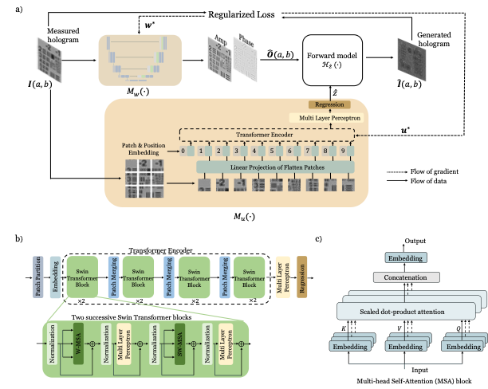

# Robust holographic reconstruction with an untrained physics-informed network
This repository contains the code for the paper 
<br /> Yunping Zhang and Edmund Y. Lam "Joint optimization for untrained
holographic imaging with physical perturbations" (_in progress_)

 In this paper, we propose J-Net, a novel approach for reliable hologram reconstruction with automatic propagation distance correction. By jointly optimizing complex-valued magnitude and propagation distance, J-Net outperforms existing methods relying on accurate imaging models. 
 It does not require extensive training on specific system configurations, making it versatile and adaptable. It achieves high-quality amplitude and phase reconstructions without prior knowledge of the precise distance.

 

<br /> If you have any question on the code, please contact the author: yp000925@connect.hku.hk

## Requirements
- Python 3
- Pytorch 1.11.0 
- cudatoolkit 11.3.1
- GPU memory >= 4G

## Usage 
### Reproduce the results in the paper

- The verification has been done on two datasets: ```data/simBio``` and ```data/simUSAF```. The results will be saved in the folder ```./results``` by default.
  - Run ```python main.py --task_config configs/simUSAF_intensity.yaml``` to reproduce the simulation results of intensity-only USAF target.
  - Run ```python main.py --task_config configs/simUSAF_phase.yaml``` to reproduce the simulation results of phase-only USAF target.
  - Run ```python main.py --task_config configs/simUSAF_complex.yaml``` to reproduce the simulation results of intensity-phase USAF target.
  - Run ```python main.py --task_config configs/simBio_phase.yaml ``` to reproduce the simulation results of phase-only Bio-cell object.
  - Run ```python main.py --task_config configs/simBio_intensity.yaml``` to reproduce the experimental results of intensity-only Bio-cell object.

### Try your own dataset 
The following is a simple process to try your own dataset.
- Prepare your own dataset. The dataset should be saved in the folder ```./data/YOUR_DATA```. The dataset should be saved in the format of ```.png``` or ```.jpg```.
- Prepare the configuration of your imaging system. It should be in the format of ```.json``` file. You may refer to the example in ```data/simBio/params.json```. Note that the distance can be roughly value instead of a precise value, and J-Net will recover. 
- Modify the function  ```parse_task``` in ```utils/general.py``` to load your own dataset properly. 
- Prepare the configuration of your iteration process in the configuration file ```configs/sample.yaml```. You may refer to the example in ```configs/simUSAF_intensity.yaml```.
- Run ```python main.py --task_config configs/sample.yaml``` to reconstruct your own data. The results will be saved in the folder ```./results```.

[//]: # (    - Modify the function ```parse_task``` in ```experiment.py``` to load your own dataset. )

[//]: # (      ```python)

[//]: # (        def parse_task&#40;exp_name&#41;: )

[//]: # (            # define the prop_kernel and measurement &#40;preprocessed hologram&#41; for each experiment)

[//]: # (            if exp_name == 'YOUR_DATA':)

[//]: # (                # define the preprocess_img function to load your own data, it should be normalized to [0,1] and the shape should be [256,256] to match the pre-trained network.)

[//]: # (                processed_img = preprocess_img&#40;'./data/YOUR_DATA'&#41;  )

[//]: # (                # define the prop_kernel, fill in your own parameters. Note that if you use resize, you should also update the parameters of deltax and deltay accordingly.)

[//]: # (                prop_kernel = dict&#40;wavelength=None,deltax=None,deltay=None,distance=None, nx=256, ny=256&#41;)

[//]: # (                return {'prop_kernel':prop_kernel, 'measurement':processed_img} )

[//]: # (      ```)
    
